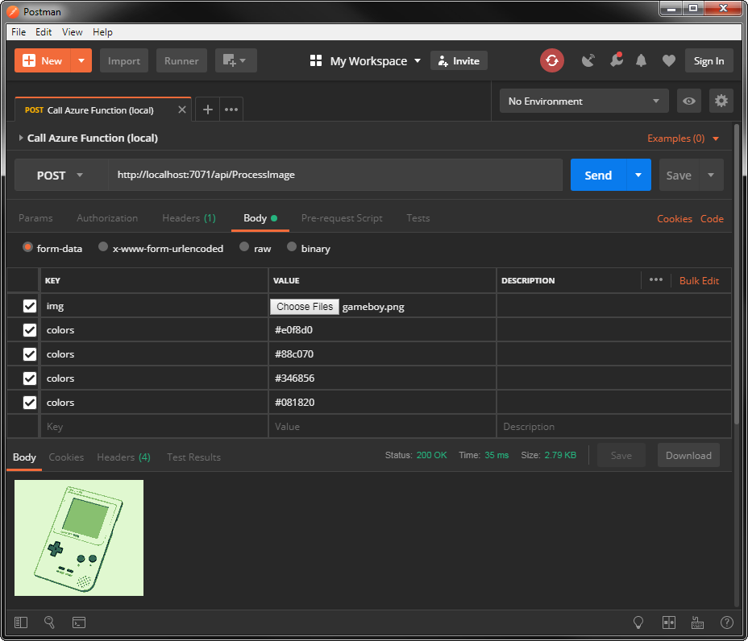

# Running an Azure Function locally
From Visual Studio: install the [Azure workload](https://visualstudio.microsoft.com/vs/visual-studio-workloads/) and F5 run the project like normal.

From the command line: `cd` to this directory and use the [Azure Functions Core Tools](https://github.com/Azure/azure-functions-core-tools) (should be installed w/ the Azure workload, Visual Studio just runs it for you).

```bash
func host start
```

Once the application indicates it's listening, send it a request:



## References
* https://docs.microsoft.com/en-us/azure/azure-functions/functions-develop-local
* https://docs.microsoft.com/en-us/azure/azure-functions/functions-create-first-azure-function-azure-cli#run-the-function-locally
