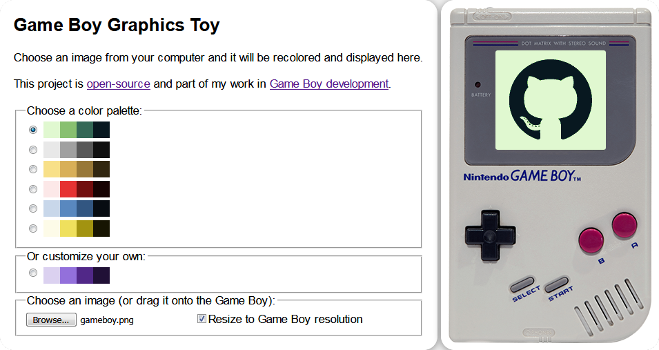

# gbgfx 
Convert images into the Game Boy's color palette -- written in .NET Core using [ImageSharp](https://github.com/SixLabors/ImageSharp).


[](https://travis-ci.org/taylus/gameboy-graphics)
[](https://coveralls.io/github/taylus/gameboy-graphics?branch=master)

This repository consists of a core library used by multiple different projects formats and served as an experiment in image processing on both the client and server using JavaScript, ASP.NET Core MVC, Blazor, and Azure Functions.

## Web application
[Click here for a live demo of the `GBGraphics.StaticSite` project.](https://legacy.codes/gameboy-graphics/GBGraphics.StaticSite/)

Alternatively, run the `GBGraphics.Web` project from Visual Studio or the .NET Core CLI:



## Command line usage
Run `GBGraphics.Console` from the command line:
```
gbgfx [-r] [-o output.png] input.png
```

`-r`

&nbsp;&nbsp;&nbsp;&nbsp;Resize the output image to fit the Game Boy's screen (160 x 144 pixels).

`-o outfile`

&nbsp;&nbsp;&nbsp;&nbsp;The name of the output file.

## Display images on a Game Boy
See here for instructions on how to [build a ROM](building_a_rom.md) which displays images produced by `gbgfx`.


