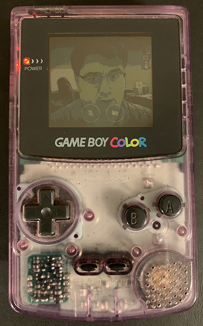

# gbgfx
Convert images into the Game Boy's color palette, making them suitable for [rgbgfx](https://rednex.github.io/rgbds/rgbgfx.1.html). Written in .NET Core using [ImageSharp](https://github.com/SixLabors/ImageSharp).


## Usage
```
gbgfx [-r] [-o output.png] input.png
```

### `-r`
Resize the output image to fit the Game Boy's screen (160 x 144 pixels).

### `-o outfile`
The name of the output file.

## Displaying images on a Game Boy
See here for instructions on how to [build a ROM](building_a_rom.md) which displays images produced by `gbgfx`!


