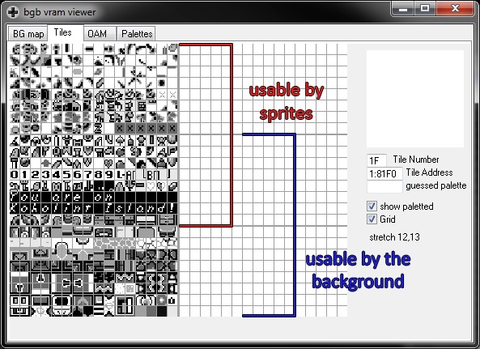
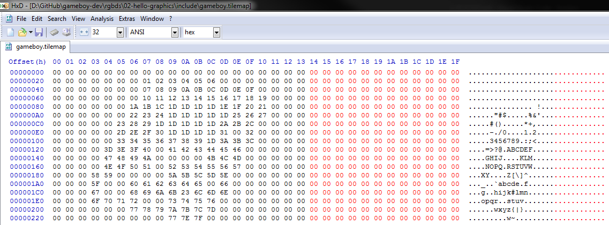
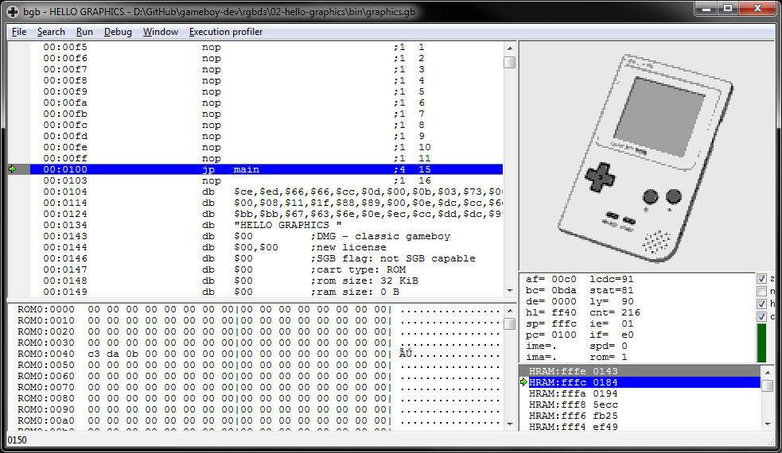
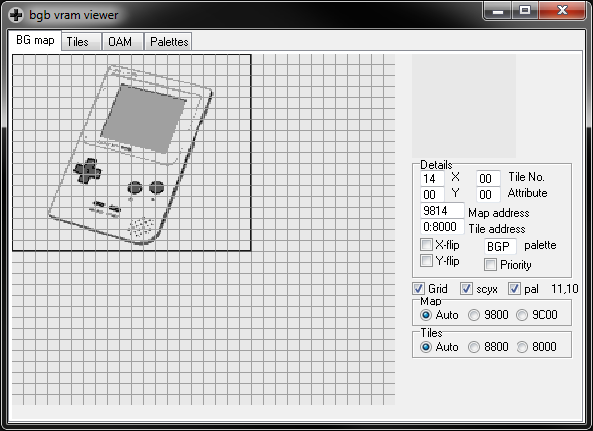

# Building a Game Boy ROM to display images
## Prepare the graphics
[Install RGBDS](https://github.com/rednex/rgbds/releases) and use it in conjunction with `gbgfx`:
```
gbgfx -o gameboy.png input\example.png
rgbgfx -u -t gameboy.tilemap -o gameboy.2bpp gameboy.png
```

### Explanation of `rgbgfx` arguments
* [`-u`](https://rednex.github.io/rgbds/rgbgfx.1.html#u) to optimize out duplicate tiles,
* [`-t`](https://rednex.github.io/rgbds/rgbgfx.1.html#t) to write a tilemap of tile index numbers suitable for reconstructing the original image.

Source: https://rednex.github.io/rgbds/rgbgfx.1.html

Your image **must be <= 256 unique tiles** after being processed by `rgbgfx` due to video memory limitations of the Game Boy:

### An aside about Game Boy video memory
The Game Boy has 8 KB of internal video RAM, 6 KB of which is used for storing tile data while the remaining 2 KB is used for storing two background tile maps (32 x 32 grids of tile numbers).

Since each tile is 16 bytes (8 x 8 pixels @ 2 bits per pixel), 6 KB allows for storing 384 tiles total. However, the tile maps index tile numbers using a single byte, which can only represent 256 values. So how are the other 128 tiles accessed? Basically, by using a separate form of addressing which is described [here](http://gbdev.gg8.se/wiki/articles/Video_Display#VRAM_Tile_Data). Most games use all the available tile space by using the first 128 tiles for sprites only, the last 128 tiles for the background only, and the middle 128 tiles shared between both. This makes it convenient to think of tile data as being stored in three separate 128-tile banks (`bgb` draws a stronger line to show the divide clearly in its VRAM viewer):



It would be possible to address all 384 tiles using both sprites and background tiles, but since the Game Boy can only draw 10 sprites per scanline, it wouldn't make sense to display images using sprites unless you could be sure most of the image was empty space. Thus, these instructions proceed with displaying the image on the Game Boy's background layer, limiting it to 256 tiles.

## Build the ROM
Incorporate the .2bpp and .tileset files produced by `rgbgfx` into [this small program](https://github.com/taylus/gameboy-dev/tree/master/rgbds/02-hello-graphics) which loads and displays background tile and map data using nothing more than simple `memcpy` and `memset` routines.

But first, note that when `rgbgfx` produced the .tileset file, it laid out the tile numbers continuously. In order to display it properly on a single Game Boy screen, we need to insert padding tiles every 20 bytes (since the Game Boy's display buffer is 32 x 32 tiles with a scrollable window of 20 x 18 tiles):

`(TODO: write something to automate this padding?)`



Once modified, drop the .tilemap and image files in that program's `include` directory, adjust the image's filename in the makefile as needed, and run `make`:

```
D:\GitHub\gameboy-dev\rgbds\02-hello-graphics>make
rgbgfx -u -o include\gameboy.2bpp include\gameboy.png
if not exist bin mkdir bin
rgbasm -o bin\main.o -i include/ src\main.asm
rgbasm -o bin\memory.o -i include/ src\memory.asm
rgblink -o bin\graphics.gb -n bin\graphics.sym bin\main.o bin\memory.o
rgbfix -v -p 0 -t "HELLO GRAPHICS" bin\graphics.gb
bgb bin\graphics.gb
```




Congratulations, you now have a ROM that displays your image!
